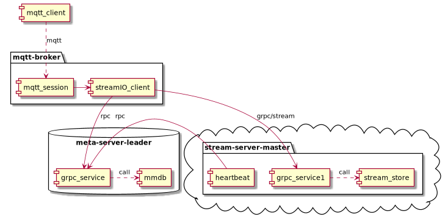

# steamIO

steamIO is a high performance message system, support `MQTT/amqp/stomp` standard messaging protocol 

* [x] stream-server
* [x] meta-server
* [x] mqtt-broker

## stream-server
stream-server is stream store,it is not base on kv store.it is really [stream store](./docs/stream_store.md).it appends data only.
it is sample,but it is high performance for streaming base system.

## meta-server
meta-server is key value store,it saves all the metadata,includes streamInfo,readOffset,StreamServerInfo,StreamServerHeartbeat,MQTTSession...,

## mqtt-broker
mqtt-broker is support cluster,High Concurrency, horizontal scale-out mqtt server.
* support Qos0,Qos1
* support offline message(message store on stream-server)
* support websocket

## todo
* [ ] amqp-broker
* [ ] stomp-broker
* [ ] meta-server support raft replicate
* [ ] stream-server support `master/slave`,`raft` replicate
* [ ] web administration and monitoring tool 